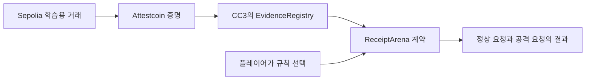

# Receipt Arena

[English](README.md) | **한국어**

실제 크로스체인 영수증을 살펴보고 지급 규칙을 고쳐, 정상 고객의 지급을 지키는 브라우저 퍼즐 게임입니다.

영수증은 이벤트가 발생했다는 사실을 증명합니다. 그렇다면 그 이벤트만으로 지급해도 될까요? 직접 요청을 선택하고 금고에 실행한 뒤, 규칙을 바꿔 방어 결과를 확인합니다.

## 플레이 방법

1. 레벨을 선택하고 정상 요청 또는 공격 요청의 영수증을 살펴봅니다.
2. 요청을 실행해 현재 규칙의 지급 결과를 확인합니다.
3. 검증 규칙을 켜거나 끄고 두 요청을 함께 검사합니다.
4. 정상 고객의 50포인트를 유지하면서 공격자의 추가 지급을 막으면 클리어됩니다.

| 레벨 | 문제 | 살펴볼 규칙 |
|---|---|---|
| 같은 모양, 다른 발행자 | 다른 계약이 똑같은 모양의 이벤트를 발행 | 발행자 확인 |
| 한 장으로 두 번 | 같은 영수증을 두 번 제출 | 라운드 안의 중복 지급 방지 |
| 첫 줄의 함정 | 정상 이벤트 앞에 미끼 로그가 존재 | 일치하는 로그 전체 탐색 |

연습에는 공개 RPC 연결이 필요하지만 지갑은 필요하지 않습니다. 선택적으로 브라우저 지갑을 사용해 Creditcoin CC3 Testnet에 클리어를 기록할 수 있으며, 이때 가스비용 테스트넷 CTC가 필요합니다. 화면은 현재 한국어이며 레벨 순서는 자유롭게 선택할 수 있습니다.

## 로컬 실행

Node.js 24와 npm을 사용합니다.

```sh
git clone https://github.com/HongD93/receipt-arena.git
cd receipt-arena
npm ci
npm run dev
```

Vite가 출력하는 URL을 엽니다. 앱은 [public/deployment.json](public/deployment.json)의 기존 배포를 조회합니다. 플레이에는 `.env` 파일이나 개인 키가 필요하지 않습니다.

```sh
npm run build
npm run preview
```

프로덕션 빌드는 `dist/`에 생성됩니다.

## 동작 구조



- **EvidenceRegistry**는 고정 네이티브 검증기 `0xFD2`를 호출하고, 영수증의 성공 상태를 확인한 뒤 일치하는 이벤트를 해석해 검증된 증거를 저장합니다.
- **ReceiptArena**는 등록된 증거에 선택한 규칙을 적용합니다. 브라우저가 점수를 정해 계약에 전달하는 대신 계약의 계산 결과를 표시합니다.
- **연습**은 계약 조회(`eth_call`)를 사용합니다. 선택적인 `complete` 거래는 규칙을 다시 평가하고 호출자의 클리어 상태를 저장합니다.

증거는 한 번 등록합니다. 플레이어는 시도할 때마다 새 증명을 요청하지 않고 등록된 시나리오를 반복해서 사용할 수 있습니다.

## 테스트넷 배포

| 네트워크 | 체인 ID | 용도 |
|---|---|---|
| Ethereum Sepolia | `11155111` | 학습용 거래 |
| Creditcoin CC3 Testnet | `102031` | 증거 등록과 게임 판정 |

| CC3 계약 | 주소 |
|---|---|
| ReceiptArena | `0x72cd8c60256caB69B5B916d1accd8eA8c6AD9931` |
| EvidenceRegistry | `0xD172498343446d937D34efd7E62cB35Fb9766675` |

[배포 정보](public/deployment.json)에 소스 거래 3건, 증거 등록 거래, 클리어 거래가 담겨 있습니다. 인터페이스는 [public/contracts.json](public/contracts.json)에 있습니다.

## 검증

```sh
npm run lint
npm test
npm run contracts:test
npm run build
npm run testnet:verify
```

계약 테스트에는 Foundry가 필요하며 컴파일러 설정은 [foundry.toml](foundry.toml)에 있습니다. `npm run verify`는 lint, Node 테스트, 계약 테스트, 웹 빌드를 한 번에 실행합니다.

`testnet:verify`는 지갑 키 없이 공개 RPC로 소스·등록 거래, 증거 식별자와 해시, 24개 규칙 조합, 클리어 기록을 확인합니다. 실행 시각을 포함한 결과는 Git에서 제외된 로컬 `docs/evidence/testnet-verification.json`에 저장합니다. 공개 RPC의 가용성에 따라 검증 실행이 영향을 받을 수 있습니다.

## 소스 구성

| 경로 | 내용 |
|---|---|
| [src/](src/) | Vue 화면과 ethers 계약 클라이언트 |
| [contracts/src/](contracts/src/) | 학습용 이벤트, 증거 등록, 게임 규칙 |
| [contracts/test/](contracts/test/) | 로컬 검증기 대역을 포함한 Solidity 테스트 |
| [scripts/](scripts/) | Foundry 실행, 테스트넷 준비, 검증 |
| [tests/](tests/) | 게임 데이터 검사 |

Vue 3, Vite, ethers, Solidity, Foundry, `@gluwa/usc-sdk`, `@gluwa/asc-contracts`를 사용합니다.

## 구현 범위

고정된 세 시나리오는 실제 테스트넷 영수증과 가상 포인트를 사용합니다. `PaymentRecorded`는 학습용 이벤트이며 경제적 결제를 증명하지 않습니다. 게임은 자산을 보관하거나 전송하지 않습니다. 중복 지급 방지는 한 게임 라운드를 모델링하며, 현재 레벨은 모든 규칙을 켜도 해결할 수 있습니다.
