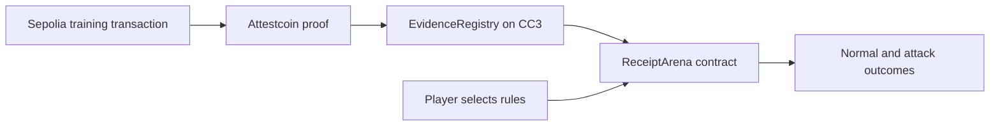

# Receipt Arena

**English** | [한국어](README.ko.md)

A browser puzzle where you inspect real cross-chain receipts, repair payment rules, and protect legitimate payouts.

A receipt proves that an event happened. Should that event authorize a payment? Select a request, run it against the vault, change the rules, and test your defense.

## Play

1. Select a level and inspect a normal or attacking request.
2. Run the request to see how the current rules handle it.
3. Toggle validation rules and test both requests together.
4. Preserve the legitimate 50 points while blocking the attacker's extra payout to clear the level.

| Level | Challenge | Rule to explore |
|---|---|---|
| The Counterfeit | A different contract emits an identical-looking event | Check the emitter |
| The Second Claim | The same receipt is submitted twice | Prevent duplicate payouts within the round |
| The Decoy Log | A decoy appears before the legitimate event | Search all matching logs |

Practice requires a public RPC connection, but no wallet. Optionally record a clear with a browser wallet on Creditcoin CC3 Testnet; this requires testnet CTC for gas. The interface currently uses Korean. Levels can be played in any order.

## Run locally

Use Node.js 24 and npm.

```sh
git clone https://github.com/HongD93/receipt-arena.git
cd receipt-arena
npm ci
npm run dev
```

Open the URL printed by Vite. The app reads the existing deployment in [public/deployment.json](public/deployment.json). No `.env` file or private key is needed to play.

```sh
npm run build
npm run preview
```

The production build is written to `dist/`.

## How it works



- **EvidenceRegistry** calls the fixed native verifier at `0xFD2`, checks receipt success, decodes matching events, and stores verified evidence.
- **ReceiptArena** evaluates the selected rules against registered evidence. The browser displays contract results rather than supplying a trusted score.
- **Practice** uses contract reads (`eth_call`). Optional `complete` transactions evaluate the rules again and store completion for the caller.

Evidence is registered once. Players reuse the scenarios without requesting a new proof for each attempt.

## Testnet deployment

| Network | Chain ID | Purpose |
|---|---|---|
| Ethereum Sepolia | `11155111` | Training transactions |
| Creditcoin CC3 Testnet | `102031` | Evidence registration and game evaluation |

| CC3 contract | Address |
|---|---|
| ReceiptArena | `0x72cd8c60256caB69B5B916d1accd8eA8c6AD9931` |
| EvidenceRegistry | `0xD172498343446d937D34efd7E62cB35Fb9766675` |

The [deployment manifest](public/deployment.json) contains the three source transactions, registrations, and completion transactions. Interfaces are in [public/contracts.json](public/contracts.json).

## Verify

```sh
npm run lint
npm test
npm run contracts:test
npm run build
npm run testnet:verify
```

Contract tests require Foundry; compiler settings are in [foundry.toml](foundry.toml). `npm run verify` runs lint, Node tests, contract tests, and the web build together.

`testnet:verify` checks source and registration transactions, evidence identifiers and hashes, all 24 rule combinations, and completion records using public RPCs without a wallet key. It writes a timestamped result to the locally ignored `docs/evidence/testnet-verification.json`. Public RPC availability affects this check.

## Source map

| Path | Contents |
|---|---|
| [src/](src/) | Vue interface and ethers contract client |
| [contracts/src/](contracts/src/) | Training events, evidence registry, and game rules |
| [contracts/test/](contracts/test/) | Solidity tests, including local verifier doubles |
| [scripts/](scripts/) | Foundry launcher, testnet preparation, and verification |
| [tests/](tests/) | Game data checks |

Built with Vue 3, Vite, ethers, Solidity, Foundry, `@gluwa/usc-sdk`, and `@gluwa/asc-contracts`.

## Scope

The three fixed scenarios use real testnet receipts and virtual points. `PaymentRecorded` is a training event, not proof of an economic payment. The game does not custody or transfer assets. Replay prevention models one game round; enabling all rules can solve the current levels.
